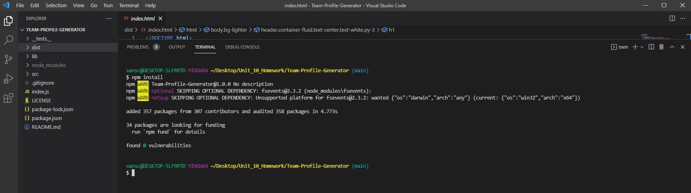
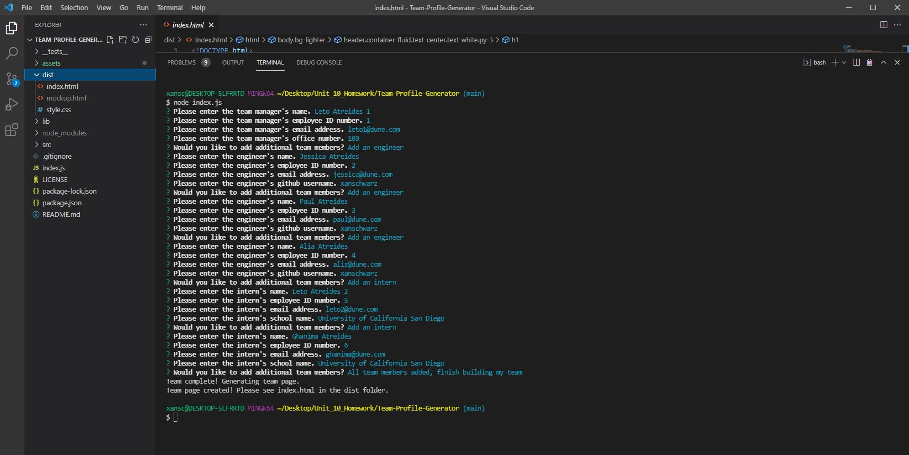
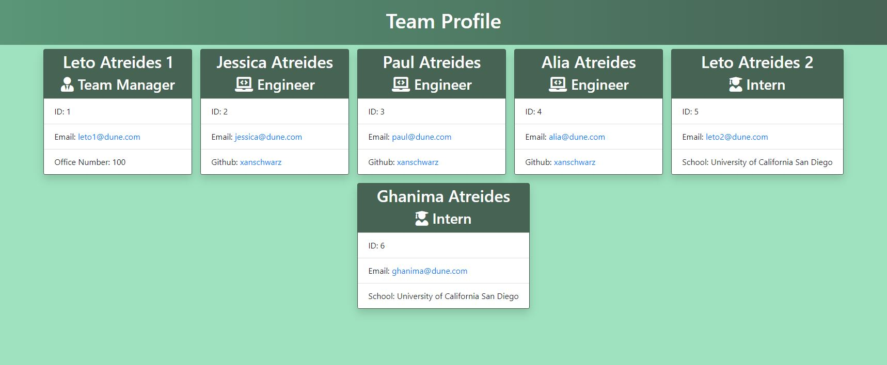
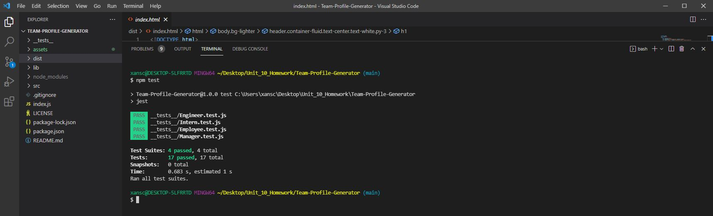

# Team-Profile-Generator

## Description

This is a command-line app that takes user input about a software engineering team and generates an HTML page with cards displaying the given details for each team member. User input is handled by Inquirer. Generating the HTML file is done with fs. Testing utilizes jest. Execution occurs in Node.js.

## Table of Contents

1. [Description](#description)
2. [Installation](#installation)
3. [Usage](#usage)
4. [License](#license)
5. [Tests](#tests)

## Installation

First you need to fork, then clone, the repository to your local, and make sure you're ready to use Node.js. After doing so, open the integrated terminal in the Team-Profile-Generator directory and in the command line enter "npm install" to install the necessary dependancies. Below is an image of the npm install.

## Usage

After installation is complete, in the integrated terminal enter "mysql -u root -p" to log in to MySQL. You will be prompted for your password. Then enter "source ./db/schema.sql", you should see queries and a database change. This will create the structure of the tables. Then enter "source ./db/seeds.sql" which will fill the tables with example values. Then you can "quit" which will exit the MySQL shell. After that, just enter "node server.js" and the app will run. The top level menu is comprised of a list of options to select from. Three of these will display each of the databases. Four of the options allow manipulation of the databases. The last option will exit the app. Below is an image of the .sql implementation and a video showing the entire process and full functionality of the app.

After installation is complete, in the integrated terminal simply enter "node index.js", this will start the app. You will then be prompted to enter details about the team manager. After entering these details you will be asked to choose between adding an engineer, an intern, or if the team is complete. These questions will be asked each time after entering all the details for a team member. Choosing the option for the team is complete will exit the prompt and generate your team profile page. You can find the new html page in the dist folder. Note that a sample HTML page has been included in this repository, running the app will automatically replace that with your new team. A picture of the prompts with sample user input is shown below, as is the page it generated.

[Video of installation, running tests, and usage.](https://drive.google.com/file/d/1lpHV9e9euWoQuIclNpLX2nOpefGrOOgJ/view)

You can see the sample generated team profile page live [here](https://xanschwarz.github.io/Team-Profile-Generator/).

## License

The license under which this project is covered is the MIT License. Learn more about that license [here](https://choosealicense.com/licenses/mit/).

## Tests

To run the included tests, in the integrated terminal simply enter "npm test". Below is an image of the tests being run successfully.

